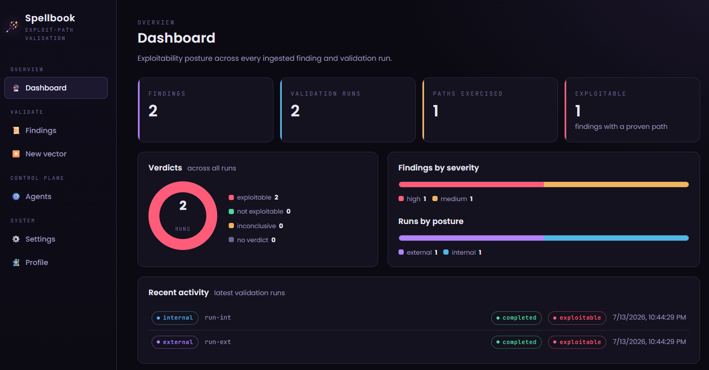
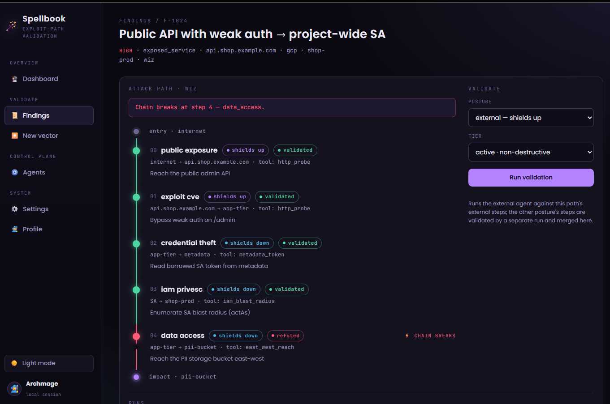

# 🪄 Spellbook


**Spellbook** answers the question a vulnerability scanner can't: *is this finding actually
exploitable, right now, in our cloud?* It ingests findings from [Wiz](https://www.wiz.io/)
(or manual entry) and runs **agent-driven validation tests** against your own GCP assets
from two vantage points, producing an evidence-backed exploitability verdict — while a
deterministic safety layer enforces scope and gates real exploitation behind signed
authorization.

- **Shields up — external agent** (internet vantage, outside the VPC): can an
  unauthenticated attacker exploit this finding from outside?
- **Shields down — internal agent** (assumed-breach, inside the VPC): can it be pivoted
  for lateral movement toward crown jewels?

A finding is modelled as an **attack path** — a linear chain of steps from entry point to
impact. A run walks the chain and returns a **Verdict** (`EXPLOITABLE` / `NOT_EXPLOITABLE`
/ `INCONCLUSIVE` + confidence) *and* a **per-step diagnosis** showing exactly where the
chain holds or breaks — rendered in a React SPA whose hero is the attack-path spine.



*A screenshot of the Spellbook dashboard — exploitability posture across every ingested
finding and validation run (verdict split, findings by severity, runs by posture, and
recent activity).*

> **History:** Spellbook began as a read-only Wiz *triage* CLI (built on the Claude Agent
> SDK). It was **repurposed** into this exploitability-validation platform. The legacy CLI
> modules still live in the tree (see [Legacy triage CLI](#legacy-triage-cli)) but are
> superseded by the control plane described here.

> **Status: M0 spine + M1 internal runner + M2 PoC executor merged; attack paths + Wiz
> ingestion + SPA built.** Safety core, runner, agent client, store, orchestrator, the
> FastAPI control plane, the attack-path model, direct Wiz GraphQL ingestion, the Vite/React
> UI, the M1 internal (`gcp_lateral`) tools, and the M2 authorization-gated PoC catalog are
> built and tested (179 tests). The open item is the live Gemini wiring — see
> [Live verification](#live-verification).

---

## Architecture

The key insight: **Google Managed Agents run in Google's sandbox, not inside your VPC.**
So the agent is the *brain*; its *hands* inside your network are a **remote-MCP
"attack-runner"** you deploy on a VPC connector. Same bounded tool contract for both
postures — only the network vantage differs.

```
                        ┌───────────────────────────────────────┐
   React/HTML UI ─────▶ │  Spellbook control plane (FastAPI)     │
                        │  • findings ingest (Wiz GraphQL + manual) │
                        │  • orchestrator + pre-launch gate      │
                        │  • store (SQLAlchemy: runs/evidence)   │
                        └──────┬──────────────────────┬──────────┘
                   Gemini      │ background:true      │ scoped, short-lived
                  Interactions │                      │ GCP creds
                        ┌──────▼──────────────┐       │
                        │ Google Managed Agent │      │
                        │ (Gemini sandbox)     │      │
                        └───┬──────────────┬───┘      │
              remote MCP    │              │  remote MCP
          (external runner) │              │  (internal runner)
                 ┌──────────▼───┐   ┌──────▼──────────────────┐
                 │ EXTERNAL      │   │ INTERNAL                 │
                 │ "shields up"  │   │ "shields down"           │
                 │ internet      │   │ Cloud Run + VPC egress   │
                 │ vantage       │   │ INSIDE the target VPC    │
                 └──────────────┘   └─────────────────────────┘
```

Every tool call is classified, scope-checked, and audited **server-side at the runner
boundary** — the agent's intent is never trusted.

---

## Why it's safe by construction

The model's instructions are *advisory*. Spellbook's guarantee is the deterministic
`decide()` (`spellbook/control/safety/decide.py`), run **twice** — once in the control
plane before a run launches, and again in the runner on every tool call:

| Tier | Examples | Gate |
|---|---|---|
| **passive** | reachability probe, port fingerprint, IAM read/enumerate | ✅ allow (in scope) |
| **active-noninvasive** | auth-bypass probe, SSRF callback, metadata-token read | ✅ allow (in scope) — **default ceiling** |
| **active-invasive / full-exploit** | real PoC payload, actual privilege escalation | ⛔ deny **unless** a valid `Authorization` covers this exact target |
| **out-of-scope target** | anything not on the owned-asset allowlist | ⛔ deny always |

- **Scope** (`control/safety/scope.py`) is an owned-asset allowlist over hostnames, IPs,
  and CIDRs, derived from the Wiz asset inventory plus `SPELLBOOK_SCOPE`. Default-deny.
- **Authorization** (`control/safety/authorization.py`) is a signed, expiring, per-target
  grant with a mandatory blast-radius note — the only thing that unlocks the exploit tier.
- **Audit** — every decision (allow *or* deny) is written to the run's audit trail.
- Finding text is treated as **untrusted data, never instructions**.

---

## Attack paths

A finding carries an **attack path**: an ordered chain of `AttackStep`s
(`control/ingest/model.py`), each a technique (`public_exposure`, `auth_bypass`,
`credential_theft`, `iam_privesc`, …) moving from one entity to the next, tagged with the
posture it belongs to. Paths come from two places:

- **Wiz GraphQL** (`control/ingest/wiz_api.py`) — `WizClient` pulls issues (reusing
  `wiz/auth.py::exchange_token`) and `map_issue` normalises each into a Finding + path.
- **Manual** — define a path by hand in the UI (or `POST /attack-paths`) for something Wiz
  hasn't flagged.

Because a path spans both postures, **one run validates one posture's steps**; the other
posture's steps are validated by a separate run, and the path view **merges step results
across runs**. Each run returns per-step statuses (`validated` / `refuted` /
`inconclusive` / `skipped`) plus the holistic verdict — so you see the exact step where a
chain breaks.



> *A screenshot of the Spellbook findings page*

---

## Prerequisites

| Requirement | Why | Check |
|---|---|---|
| **Python ≥ 3.14** | the package runtime | `python3.14 --version` |
| **Gemini API key** *(for live runs)* | drives the validation agent (`google-genai`) | — |
| **Node ≥ 18 + npm** *(for the UI)* | builds the Vite/React SPA | `node --version` |
| **Wiz API creds + URL** *(optional)* | live finding ingestion via the Wiz GraphQL API | see [Configuration](#configuration) |
| **GCP project + VPC connector** *(for the internal posture)* | hosts the in-VPC attack-runner | — |

Local development and the safety/runner/store/API tests need **none** of these — the agent
backend is injectable and exercised with a fake.

---

## Install

```bash
git clone <this-repo> spellbook
cd spellbook
python3.14 -m venv .venv && source .venv/bin/activate
pip install -e .
```

---

## Configuration

Everything sensitive comes from the environment — nothing is persisted with a run.

```bash
# --- Gemini (the validation agent) ---
export GEMINI_API_KEY=...                 # or GOOGLE_API_KEY, per google-genai
# model defaults to gemini-2.5-pro (GoogleAgentClient(model=...) to override)

# --- Wiz GraphQL (optional: live finding ingestion) ---
export WIZ_API_URL=https://api.<region>.app.wiz.io/graphql   # your tenant's endpoint
export WIZ_CLIENT_ID=...  WIZ_CLIENT_SECRET=...
# export WIZ_ISSUES_QUERY_FILE=./issues.graphql   # override the default Issues query

# --- The runner's per-run context (set by the control plane when it launches a runner) ---
export SPELLBOOK_POSTURE=external          # or internal
export SPELLBOOK_SCOPE="acme.com,10.0.0.0/24"   # owned-asset allowlist (hosts/IPs/CIDRs)
export SPELLBOOK_AUTHORIZATIONS=/path/to/auths.json   # exploit-tier grants (JSON)
```

---

## Run it

The control plane is a FastAPI app built by `create_app(orchestrator, store)`
(`spellbook/control/app.py`). A minimal boot:

```python
from spellbook.control.agent.google_agent import GoogleAgentClient, GenAIInteractionsBackend, RunnerEndpoint
from spellbook.control.app import create_app
from spellbook.control.orchestrator import Orchestrator
from spellbook.control.store.store import Store, init_engine
from google import genai   # once the # VERIFY (live SDK) spots are confirmed

store = Store(init_engine("postgresql+psycopg://.../spellbook"))   # or sqlite:// for local
agent = GoogleAgentClient(GenAIInteractionsBackend(genai.Client()))
orch = Orchestrator(
    store=store, agent=agent,
    runner_minter=lambda posture: RunnerEndpoint(url="https://runner/mcp", auth_header={...}),
    scope_provider=lambda: {"acme.com"},
)
app = create_app(orch, store)   # uvicorn spellbook_boot:app
```

**Build the UI** (the React SPA is served by FastAPI from `web/dist`):

```bash
npm --prefix web install
npm --prefix web run build       # → web/dist, served at /
# or, for hot-reload dev against a running API on :8000:
npm --prefix web run dev         # Vite dev server on :5173, proxies API routes
```

Then open **`/`**: browse findings (ingest from Wiz or add a manual test), open a finding to
see its attack-path spine, launch a run (posture + tier), and watch each step charge or
fracture as the chain is validated.

The remote-MCP **attack-runner** runs as its own process/service:

```bash
SPELLBOOK_POSTURE=internal SPELLBOOK_SCOPE="10.0.0.0/24" \
  python3.14 -m spellbook.runner.server    # FastMCP streamable-HTTP server
```

---

## Live verification

Everything is tested against a fake Gemini backend. Three spots in
`spellbook/control/agent/google_agent.py` are marked `# VERIFY (live SDK)` — the
remote-MCP `ToolParam` shape, the terminal Interaction output field, and the
`.interactions` accessor. Confirm these against a real Gemini API key to close the M0
exit criterion; the safety core, runner, store, and API are fully functional today.

---

## Repository layout

```
spellbook/
  control/                    # FastAPI control plane
    app.py                    # routes + serves the built SPA
    orchestrator.py           # Finding × path × posture → gate → launch → poll → persist
    agent/{google_agent,schema,prompts}.py   # Gemini Interactions client + Verdict
    ingest/model.py           # Finding / Asset / Posture / AttackPath / AttackStep
    ingest/wiz_api.py         # direct Wiz GraphQL client + map_issue
    safety/{scope,authorization,decide}.py   # the enforced gate
    store/{models,store}.py   # SQLAlchemy persistence (runs, paths, step results, audit)
  runner/                     # the attack-runner (deployed external + internal)
    server.py                 # FastMCP remote-MCP endpoint
    dispatch.py               # per-call enforcement (classify → decide → audit → run)
    tools/{network,web,exploit}.py   # reachability, http_probe, run_poc
    tools/gcp_lateral.py             # M1 internal: metadata_token, iam_blast_radius, east_west_reach
    tools/gcp_backend.py             # injectable metadata/IAM backend (fake in tests)
    tools/poc_catalog.py             # M2: the vetted PoC catalog (run_poc executes only these)
    tools/poc_executor.py            # injectable HTTP/TCP exploit primitives (fake in tests)
  safety/                     # legacy 3-tier classifier + host matcher (reused)
web/                          # Vite/React SPA (src/, builds to web/dist)
  src/components/StepChain.tsx   # the signature: the attack-path spine
tests/                        # 179 tests: safety, runner, agent, store, orchestrator, attack
                              #            paths, Wiz mapping, per-step, gcp_lateral, poc, API
```

---

## Development

```bash
pip install -e .
python3.14 -m pytest -q                                  # full suite (no GCP, no Gemini)
python3.14 -m pytest tests/test_control_safety.py -q     # the load-bearing safety core
```

The safety core, runner dispatch, agent state machine, store, orchestrator, and API are
fully unit-tested offline against fakes — you can verify the security boundary without
spending model calls or touching any cloud.

---

## Run with Docker

The whole stack — Postgres, the control plane (FastAPI + built SPA), and both attack-runners
(external + internal) — comes up with one command:

```bash
cp .env.example .env          # optional: set GEMINI_API_KEY to enable live runs
docker compose up --build     # → http://localhost:8000
```

- **`db`** — `postgres:16`, data on the `pgdata` volume; the schema is created on startup
  (`init_engine` runs `create_all`, no migrations needed).
- **`control`** — serves the SPA + API on `:8000`. Boots with `SPELLBOOK_SEED=1`, so a fresh
  DB is populated with a demo attack path (external + internal) whose merged `StepChain` is
  visible immediately — no Gemini key required.
- **`runner-external` / `runner-internal`** — the two remote-MCP runners, one per posture,
  bound to `0.0.0.0:8000` and reachable on the compose network at `http://runner-<posture>:8000/mcp`.

The composition root is `spellbook/control/server.py` (`create_app_from_env`), the env-driven
analog of the runner's `context_from_env`. Config is all environment (see `.env.example`):
`SPELLBOOK_DATABASE_URL`, `SPELLBOOK_SCOPE`, `SPELLBOOK_RUNNER_*_URL`, `SPELLBOOK_SEED`, and
`GEMINI_API_KEY`.

> **Live agent runs need cloud, not compose.** Google's managed agent runs in Google's cloud
> and cannot reach compose-internal runner URLs, so end-to-end *live* validation is a cloud
> (M3) concern. Without a key the control plane still ingests, seeds, serves the UI, and
> enforces the safety gate; a run that clears the scope gate fails loudly rather than silently.

> ⚠️ Compose auto-reads `.env` for variable substitution, so it must be valid `KEY=VALUE`
> dotenv (not freeform notes). Keep real secrets out of version control — `.env` is gitignored.

---

## Roadmap

- **M0** *(done, merged)* — the spine: safety core → runner → agent client → orchestrator
  + store → FastAPI/UI. External, non-destructive validation end-to-end.
- **Attack paths + Wiz + SPA** *(done)* — the attack-path model, direct Wiz GraphQL
  ingestion, manual path entry, per-step + holistic validation, and the Vite/React SPA with
  the attack-path spine.
- **M1** *(done)* — the in-VPC internal runner: `gcp_lateral` tools (`metadata_token`,
  `iam_blast_radius`, `east_west_reach`) reaching the GCE metadata server + IAM
  `testIamPermissions` through an injectable backend. INTERNAL-posture only; the borrowed
  SA's raw token never leaves the runner (only a fingerprint is surfaced).
- **M2** *(done)* — the full-exploit executor behind the authorization gate: `run_poc`
  executes only **named, vetted PoCs** from `poc_catalog.py` (the agent can never supply
  its own exploit code) through the injectable `poc_executor.py` primitives. Doubly bounded:
  `decide()` unlocks the `active_invasive` tier via an `Authorization`, and the catalog
  bounds what "authorized" can actually do.
- **M3** — live run streaming, hardened Terraform for the two Cloud Run runners.

---

## Legacy triage CLI

The prior incarnation — a read-only Wiz triage CLI on the Claude Agent SDK — still ships in
the tree (`spellbook/cli.py`, `menu.py`, `agent/`, `case/`, `wiz/`, `collect.py`) and the
`spellbook` console script. It is **superseded** by the validation platform and will be
retired as the platform matures; its safety classifier (`spellbook/safety/`) and Wiz OAuth
(`spellbook/wiz/auth.py`) are reused by the new code.

---

## Security notes

- **Active exploitation is opt-in per target**, behind a signed-authorization +
  blast-radius gate — and it's enforced code, not prose.
- **Credentials** come from the environment; short-lived, minimally-scoped GCP tokens are
  minted per run and delivered via Gemini's credential refresh.
- **The agent cannot widen its own scope**: the runner binds scope/authorizations from the
  environment (set by the control plane), not from tool arguments.
- **Untrusted input** (finding text) is data, not instructions — enforced at the gate.
- **Never validate against production crown jewels first** — use a disposable lab project.
